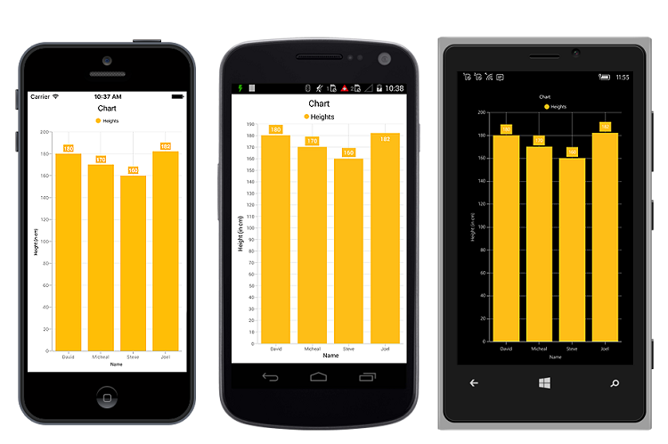

# Getting Started for Xamarin.Forms Charts
This is demo application of Xamarin.Forms SfChart control. The minimal set of required properties have been configured in this project to get started with SfChart in Xamarin.Forms.

For more details please refer the Xamarin.Forms SfChart UG documentation [Getting Started](https://help.syncfusion.com/xamarin/sfchart/getting-started) link.

## <a name="requirements-to-run-the-demo"></a>Requirements to run the demo ##

* [Visual Studio 2017](https://visualstudio.microsoft.com/downloads/) or [Visual Studio for Mac](https://visualstudio.microsoft.com/vs/mac/).
* Xamarin add-ons for Visual Studio (available via the Visual Studio installer).

## <a name="troubleshooting"></a>Troubleshooting ##
### Path too long exception
If you are facing path too long exception when building this example project, close Visual Studio and rename the repository to short and build the project.

## <a name="description"></a>Description ##

### Initialize Chart

Import the [`SfChart`](https://help.syncfusion.com/cr/cref_files/xamarin/Syncfusion.SfChart.XForms~Syncfusion.SfChart.XForms.SfChart.html) namespace as shown below in your respective Page,

###### Xaml
```xaml
xmlns:chart="clr-namespace:Syncfusion.SfChart.XForms;assembly=Syncfusion.SfChart.XForms" 
```
###### C#
```C#
using Syncfusion.SfChart.XForms;
```

Then initialize an empty chart with [`PrimaryAxis`](https://help.syncfusion.com/cr/cref_files/xamarin/Syncfusion.SfChart.XForms~Syncfusion.SfChart.XForms.SfChart~PrimaryAxis.html) and [`SecondaryAxis`](https://help.syncfusion.com/cr/cref_files/xamarin/Syncfusion.SfChart.XForms~Syncfusion.SfChart.XForms.SfChart~SecondaryAxis.html) as shown below,

###### Xaml
```xaml
<chart:SfChart>

<chart:SfChart.PrimaryAxis>
    <chart:CategoryAxis/>
</chart:SfChart.PrimaryAxis>

<chart:SfChart.SecondaryAxis>
    <chart:NumericalAxis/>
</chart:SfChart.SecondaryAxis>

</chart:SfChart>
```
###### C#
```C#
SfChart chart = new SfChart();

//Initializing Primary Axis
CategoryAxis primaryAxis = new CategoryAxis();
chart.PrimaryAxis = primaryAxis;

//Initializing Secondary Axis
NumericalAxis secondaryAxis  =  new NumericalAxis  ();
chart.SecondaryAxis = secondaryAxis;

this.Content = chart;
```

### Initialize view model

Now, let us define a simple data model that represents a data point in [`SfChart`.](https://help.syncfusion.com/cr/cref_files/xamarin/Syncfusion.SfChart.XForms~Syncfusion.SfChart.XForms.SfChart.html)

```C#
public class Person   
{   
    public string Name { get; set; }

    public double Height { get; set; }
}
``` 

Next, create a view model class and initialize a list of `Person` objects as shown below,

```C#
public class ViewModel  
{
    public List<Person> Data { get; set; }      

    public ViewModel()       
    {
        Data = new List<Person>()
        {
            new Person { Name = "David", Height = 180 },
            new Person { Name = "Michael", Height = 170 },
            new Person { Name = "Steve", Height = 160 },
            new Person { Name = "Joel", Height = 182 }
        }; 
    }
}
```

Set the `ViewModel` instance as the `BindingContext` of your Page; this is done to bind properties of `ViewModel` to [`SfChart`.](https://help.syncfusion.com/cr/cref_files/xamarin/Syncfusion.SfChart.XForms~Syncfusion.SfChart.XForms.SfChart.html)

N> Add namespace of `ViewModel` class in your XAML page if you prefer to set `BindingContext` in XAML.

###### Xaml
```Xaml
<ContentPage xmlns="http://xamarin.com/schemas/2014/forms"
xmlns:x="http://schemas.microsoft.com/winfx/2009/xaml"
x:Class="ChartDemo.MainPage"
xmlns:chart="clr-namespace:Syncfusion.SfChart.XForms;assembly=Syncfusion.SfChart.XForms"
xmlns:local="clr-namespace:ChartDemo"> 

<ContentPage.BindingContext>
    <local:ViewModel></local:ViewModel>
</ContentPage.BindingContext>

</ContentPage>
```
###### C#
```C#
this.BindingContext = new ViewModel();
```
### Populate Chart with data

As we are going to visualize the comparison of heights in the data model, add [`ColumnSeries`](https://help.syncfusion.com/cr/cref_files/xamarin/Syncfusion.SfChart.XForms~Syncfusion.SfChart.XForms.ColumnSeries.html) to [`SfChart.Series`](https://help.syncfusion.com/cr/cref_files/xamarin/Syncfusion.SfChart.XForms~Syncfusion.SfChart.XForms.SfChart~Series.html) property, and then bind the Data property of the above `ViewModel` to the [`ColumnSeries.ItemsSource`](https://help.syncfusion.com/cr/cref_files/xamarin/Syncfusion.SfChart.XForms~Syncfusion.SfChart.XForms.ChartSeries~ItemsSource.html) property as shown below.

N> You need to set [`XBindingPath`](https://help.syncfusion.com/cr/cref_files/xamarin/Syncfusion.SfChart.XForms~Syncfusion.SfChart.XForms.ChartSeries~XBindingPath.html) and [`YBindingPath`](https://help.syncfusion.com/cr/cref_files/xamarin/Syncfusion.SfChart.XForms~Syncfusion.SfChart.XForms.XyDataSeries~YBindingPath.html) properties, so that [`SfChart`](https://help.syncfusion.com/cr/cref_files/xamarin/Syncfusion.SfChart.XForms~Syncfusion.SfChart.XForms.SfChart.html) would fetch values from the respective properties in the data model to plot the series.

###### Xaml
```xaml
<ContentPage.BindingContext>
    <local:ViewModel/>
</ContentPage.BindingContext>

<chart:SfChart>

<chart:SfChart.PrimaryAxis>
    <chart:CategoryAxis>
        <chart:CategoryAxis.Title>
            <chart:ChartAxisTitle Text="Name"> </chart:ChartAxisTitle>
        </chart:CategoryAxis.Title>
    </chart:CategoryAxis>
</chart:SfChart.PrimaryAxis>

<chart:SfChart.SecondaryAxis>
    <chart:NumericalAxis>
        <chart:NumericalAxis.Title>
            <chart:ChartAxisTitle Text="Height (in cm)"></chart:ChartAxisTitle>
        </chart:NumericalAxis.Title>      
    </chart:NumericalAxis>   
</chart:SfChart.SecondaryAxis>

<chart:SfChart.Series>
    <chart:ColumnSeries ItemsSource="{Binding Data}" XBindingPath="Name" YBindingPath="Height"/>
</chart:SfChart.Series>

</chart:SfChart> 
```

###### C#
```C#
this.BindingContext = new ViewModel();
SfChart chart = new SfChart();

//Initializing primary axis
CategoryAxis primaryAxis = new CategoryAxis();
primaryAxis.Title.Text = "Name";
chart.PrimaryAxis = primaryAxis;

//Initializing secondary Axis
NumericalAxis secondaryAxis = new NumericalAxis();
secondaryAxis.Title.Text = "Height (in cm)";
chart.SecondaryAxis = secondaryAxis;

//Initializing column series
ColumnSeries series = new ColumnSeries();
series.SetBinding(ChartSeries.ItemsSourceProperty, "Data");
series.XBindingPath = "Name";
series.YBindingPath = "Height";
chart.Series.Add(series);

this.Content = chart;
```

## <a name="output"></a>Output ##


